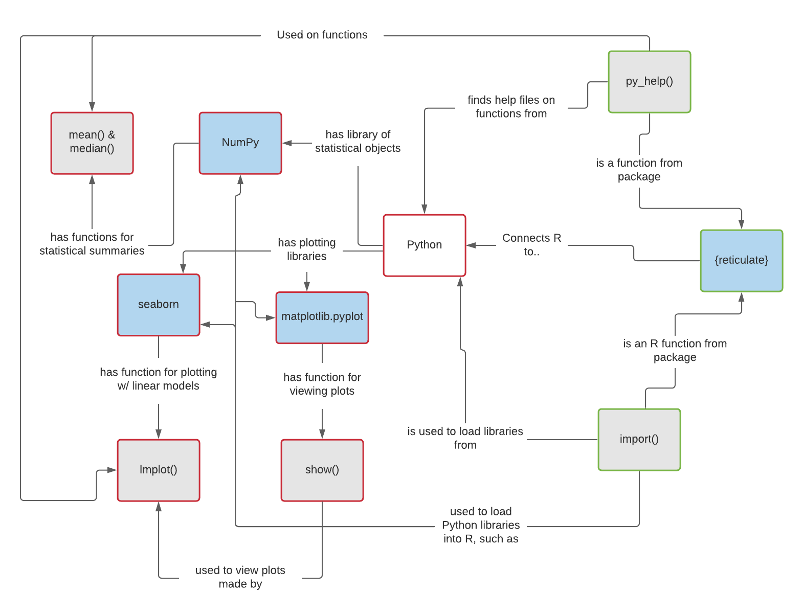

```{r setup, include=FALSE}
knitr::opts_chunk$set(echo = TRUE)
```

# Using Python in R with `{reticulate}`

## 1: Learning Persona

### General Background

* Herbert Jones is from Paris 

* He lives in Wales after going to university in Cardiff studying finance

* He loves to go kayaking in his spare time


### Starting Point

* He is a Data Scientist at a financial company who has been using R in his work for over 2 years

* He is very comfortable using R and all of the tidyverse packages

* He knows no Python, but some of his colleagues use it for their work


### Needs

* One of his colleagues has created a Python package, which computes a specific calculation that he needs

* He has read online that you can connect Python to R, but has no idea where to start

* He wants to understand the basics of how R can connect to Python, so that he can attempt to use some Python packages in his work


### Special Considerations

* He only has 15 minutes to sit in a lesson, but can do 'homework' afterwards


### Lesson Goal

*From this persona - we can define a synopsis for the course, in terms that the attendees can understand.*

This lesson gives an introduction to using the `{reticulate}` package to use Python libraries and code in R, by showing examples with some core libraries and functions, providing key transferable skills to allow you to use some Python code in your own R projects.


## 2: Concept Map


```{r echo=FALSE}

```


## 3: Summative Assessment 

For the purpose of this sample class I will not be including the summative assessment during delivery; however, I find it helps when planning out the lesson and formative assessments so I have included it here. In a real scenario, if there was not time to do this during a lesson, I would set as a 'homework' type task, and check in with the attendee(s) at a later date.

1. Create a linear model plot for `Sepal.Length` against `Sepal.Width` for the `iris` data set

2. Open the help file for the `lmplot` function, find the argument to change the colour of the plot to depend on the `Species` variable

*Extension:*

3. Using any methods you'd like (help files, internet, tab completion ...) - create a boxplot chart showing the distribution of the `Sepal.Length` variable, per each `Species`


## 4: Formative Assessments

### FA1 : Checking understanding of Python vs R packages when using them in R

**Multiple choice:** Which of the following code blocks works to correctly load in the Python NumPy package, and use the min function on the mpg column of mtcars;

```{r FA1_1, eval=FALSE}
### 1
library(reticulate)
library(NumPy)
NumPy::min(mtcars$mpg)
```

```{r FA1_2, eval=FALSE}
### 2
library(reticulate)
np <- import(numpy)
np::min(mtcars$mpg)
```

```{r FA1_3, eval=FALSE}
### 3
library(reticulate)
np <- import('numpy')
np$min(mtcars$mpg)
```

```{r FA1_4, eval=FALSE}
### 4
library(reticulate)
library(NumPy)
NumPy$min(mtcars$mpg)
```

### FA2: Checking understanding of order of code, when producing a plot using seaborn

**Parsons Problem:** Rearrange the following code lines to be in the correct order to produce a python plot

```{r FA2, eval = FALSE}
# 1
plt <- import("matplotlib.pyplot")
sb <- import("seaborn")

# 2
plt$show()

# 3
sb$lmplot(data = mtcars, x = "mpg", y = "wt")

# 4
library(reticulate)
```


## 5: Lesson Plan

1. Connecting R to Python
2. Loading in a Python Library
3. Accessing Python Functions
4. Formative Assessment 1
5. Creating a Plot
6. Formative Assessment 2
7. Summative Assessment
8. Further Reading

Notes are provided in `Using_Python_in_R_with_reticulate.html` slide deck, throughout the session, the notes are used as 'back up', I will be live coding throughout, and showing all examples in RStudio.

### Course Pre-Requisites

Prior to sitting this lesson, you will need to have a recent version of Anaconda installed on your computer, which can be found [here](https://www.anaconda.com/products/individual).

You will also need R, RStudio, and will need to have the `{reticulate}` package installed in R. This can be done in the standard way; 

```{r eval=FALSE}
install.packages("reticulate")
```

