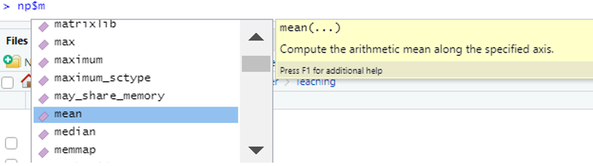
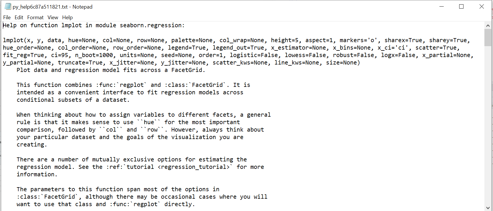
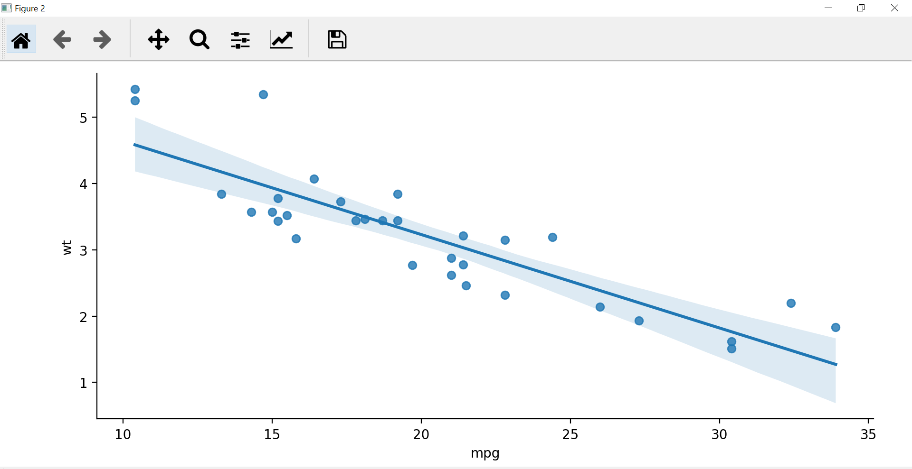

```{r setup, include=FALSE}
knitr::opts_chunk$set(echo = TRUE)
```


## Connecting R to Python

To connect Python into our R session, we can use the `{reticulate}` package, it's handy function `py_available()` checks if we can access Python sufficiently. 

```{r reticulate_load}
library(reticulate)

py_available(initialize = TRUE)
```


### TIP: `use_python()`

If you're like me and have more than one Python installation on your computer - then you can specify which one by supplying `use_python()` with a path to the location of the executable needed.


## Loading in a Python Library

```{r import_numpy}
# create variable with library name
np <- import("numpy")
```

We can see Python functions from this package on the [numpy website](https://numpy.org/doc/stable/).


## Accessing Python Functions

In Python when we want to use functions from a package we must always specify the package that it comes from. In R this would be the same as always using the `::` to reference functions i.e. `dplyr::select()`

When using Python in R, we use the `$` symbol to access functions

```{r numpy1, eval=FALSE}
np$mean(...)
```

## Python Help Files

To know what to put into our function, we can use Pythons help system via the `py_help` function;

```{r help_numpy1, eval=FALSE}
py_help(np$mean)
```

```{r help_numpy2, echo=FALSE, out.width='50%'}
knitr::include_graphics("images/Numpy Help.png", )
```

## Using Python Functions

Once we know what the Python function we need is, we can use it on many R objects, as we would R functions;

```{r numpy2}
np$mean(mtcars$mpg)
```

We can also use tab completion to see other functions in the package;

```{r numpy_tab, echo=FALSE, out.width='70%'}

```

```{r numpy3}
np$median(mtcars$mpg)
```

## Formative Assessment 1

**Multiple choice:** Which of the following code blocks works to correctly load in the Python `NumPy` package, and use the `min` function on the `mpg` column of `mtcars`;

```{r FA1_1, eval=FALSE}
library(reticulate)          ### 1
library(NumPy)
NumPy::min(mtcars$mpg)
```

```{r FA1_2, eval=FALSE}
library(reticulate)          ### 2
np <- import(numpy)
np::min(mtcars$mpg)
```

```{r FA1_3, eval=FALSE}
library(reticulate)          ### 3
np <- import('numpy')
np$min(mtcars$mpg)
```

```{r FA1_4, eval=FALSE}
library(reticulate)          ### 4
library(NumPy)
NumPy$min(mtcars$mpg)
```

## Creating a Plot

For plotting we use the [seaborn package](https://seaborn.pydata.org/) and function `lmplot()`:

```{r import_seaborn}
sb <- import("seaborn")
```

```{r help_sb1, eval=FALSE}
py_help(sb$lmplot)
```

```{r help_sb2, echo=FALSE, out.width='80%'}

```

---

Let's create a simple plot of mpg vs wt from mtcars.

```{r seaborn1}
sb$lmplot(data = mtcars, x = "mpg", y = "wt")
```

### WARNING: `sb$lmplot()` doesn't 'print' the plot

Nothing comes out of the above code, this just creates the object - similar to creating the following in R;

```{r ggplot_ex1}
library(ggplot2)
p <- ggplot(data=mtcars, aes(x=mpg, y=wt)) +
  geom_point() +
  geom_smooth()
```

---

Within R to view this plot, we simply `print` it (or just call the object):

```{r ggplot_ex2, out.width='50%'}
print(p)
```

But this is a little different in Python... 

---

We need to now '`print`' our seaborn plot to see it - we cannot use the standard print function from R, but must use something similar from Python. The following loads in part of the `matplotlib` package in Python, so we can view the plot.

Runnig below opens a new window external to RStudio, for you to view the plot.

```{r seaborn2, eval = FALSE}
plt <- import("matplotlib.pyplot")
plt$show()
```

```{r seaborn_plot_out, echo=FALSE, out.width='60%'}

```

This prints all the Python plots waiting to be generated.

## Formative Assessment 2

**Parsons Problem:** Rearrange the following code lines to be in the correct order to produce a python plot

```{r FA2, eval = FALSE}
# 1
plt <- import("matplotlib.pyplot")
sb <- import("seaborn")

# 2
plt$show()

# 3
sb$lmplot(data = mtcars, x = "mpg", y = "wt")

# 4
library(reticulate)
```

## Plotting using seaborn in R - Whole Process

```{r full_plot, eval=FALSE}
# load in reticulate & if needed check python is available
library(reticulate)
# py_available(initialize = TRUE)

# load in python libraries
plt <- import("matplotlib.pyplot")
sb <- import("seaborn")

# create our plot
sb$lmplot(data = mtcars, x = "mpg", y = "wt")

# view it
plt$show()
```

## Summative Assessment

1. Create a linear model plot for `Sepal.Length` against `Sepal.Width` for the `iris` data set

2. Open the help file for the `lmplot` function, find the argument to change the colour of the plot to depend on the `Species` variable

*Extension:*

3. Using any methods you'd like (help files, internet, tab completion ...) - create a boxplot chart showing the distribution of the `Sepal.Length` variable, per each `Species`


## Further Information

* [Cheat sheet for `{reticulate}`](https://raw.githubusercontent.com/rstudio/cheatsheets/master/reticulate.pdf)
* [`{reticulate}` website](https://rstudio.github.io/reticulate/)
* [NumPy Documentation]() 
* [Seaborn Website]()
